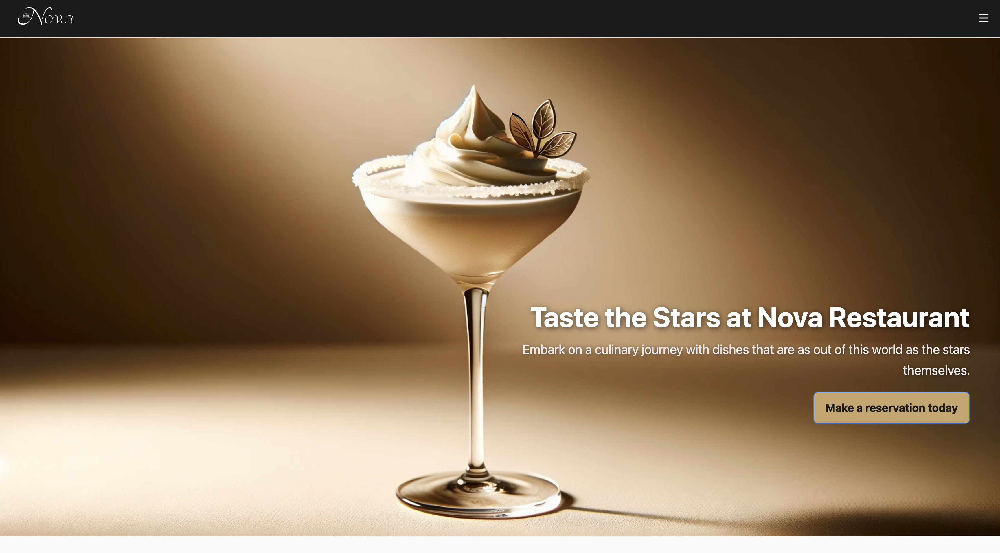
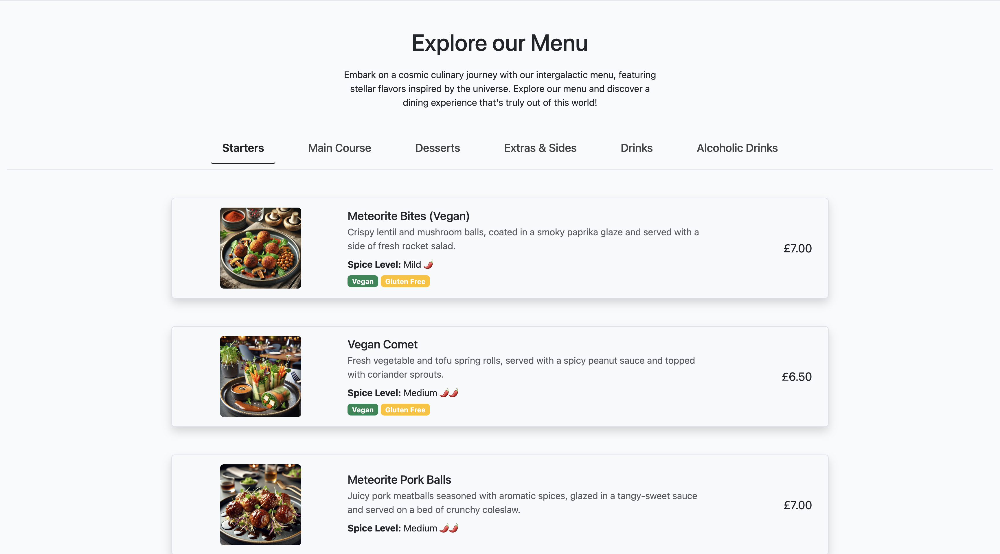
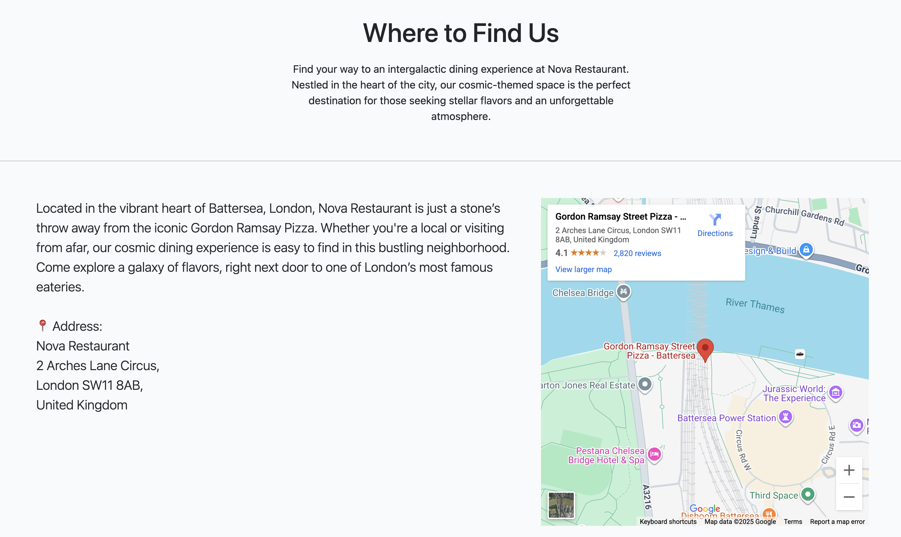
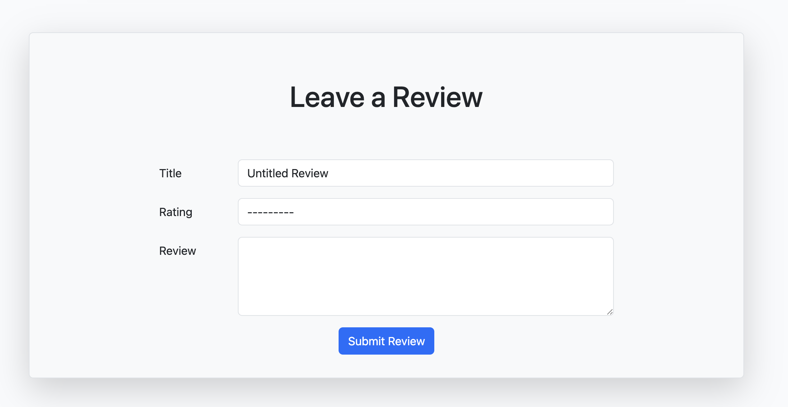
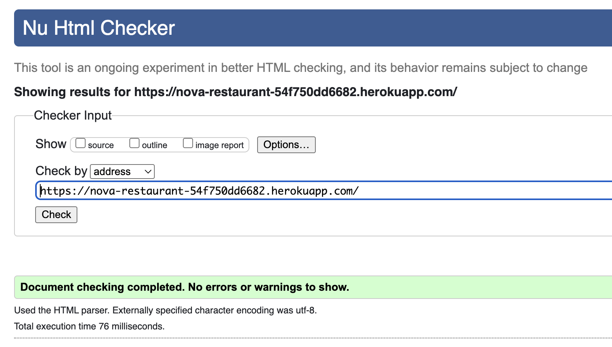
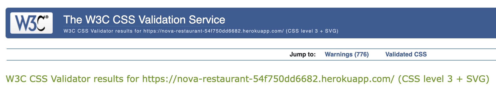
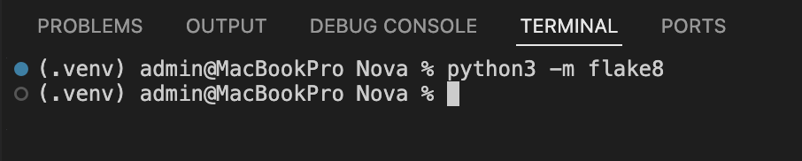
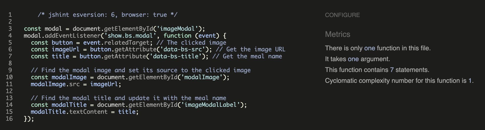
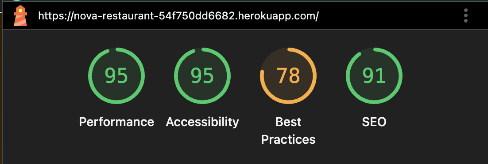

# Nova Restaurant


[**Link to the live website**](https://nova-restaurant-54f750dd6682.herokuapp.com/)


# Project Overview

Nova Restaurant is a modern, immersive web application designed to capture the unique dining experience of a futuristic restaurant. Built as part of my journey in full-stack web development at Code Institute, this project showcases innovative design, responsive functionality, and seamless user interactions that reflect the restaurant’s star-inspired theme.

## Features

### Homepage



**Design Rationale:**
- Clean, minimal hero section to immediately capture attention.
- High-quality cocktail image to reflect the elegance and luxury of Nova Restaurant.
- Bold headline with inviting subtext to clearly communicate the restaurant’s unique experience.
- Prominent call-to-action button (“Make a reservation today”) for quick user engagement.
- Warm colour palette for a sophisticated, welcoming feel.

### Menu Page



**Design Rationale:**
- Clean, card-based layout for easy scanning of dishes.
- High-quality, appetising food images to encourage user engagement.
- Clear spice-level indicators with visual icons for quick recognition.
- Dietary labels (Vegan, Gluten Free) prominently displayed for accessibility and inclusivity.
- Tab navigation for quick switching between categories without leaving the page.
- Consistent pricing placement for improved readability.

### Reservations Page


**Design Rationale:**
- Minimalist and user-friendly form layout for quick booking.
- Clear input fields for essential booking details (name, contact info, date, time, number of guests).
- Integrated date and time pickers to reduce input errors.
- Prominent “Book Now” button for immediate call-to-action.
- Display of existing reservations for user clarity and confirmation.
- Informative opening hours and booking guidelines placed above the form to set clear expectations.

### Find Us Page



**Design Rationale:**
- Clean, centralised heading with a short description to welcome visitors.
- Informative location text that highlights the restaurant’s vibrant surroundings.
- Physical address displayed clearly with an address icon for quick recognition.
- Integrated Google Maps embed for easy navigation and route planning.
- Balanced two-column layout: text on the left, interactive map on the right.
- Maintains brand tone with cosmic-themed language while ensuring practicality for users.

### Leave a Review Page



**Design Rationale:**
- Clean, minimal form layout to encourage user participation.
- Large heading to clearly communicate the page’s purpose.
- Simple three-field structure: review title, rating, and main feedback area.
- Prominent blue “Submit Review” button to draw attention and improve conversion.
- Plenty of whitespace around fields for a distraction-free experience.
- Maintains consistent styling with rounded corners and light background to match the rest of the site’s aesthetic.
- Designed for clarity and usability across devices, ensuring an accessible review submission process.

## Key Features

- **Immersive Visual Experience:**  
  - A dynamic hero section featuring high-quality imagery and overlay text invites visitors to "Taste the Stars at Nova Restaurant."

- **Dynamic Menu & Reservation System:**  
  - Detailed, visually rich menu pages with images, descriptions, pricing, and dietary details.
  - An online reservation system that streamlines the booking process for guests.

- **Customer Reviews & Feedback:**  
  - Customers can leave reviews and share their dining experiences, providing valuable insights for future guests.

- **Robust Contact Functionality:**  
  - A contact page accessible to all users (logged in or not) where messages are stored in the database and managed by superusers.

- **Cloud Integration & Modern Tech Stack:**  
  - Utilizes Django for the backend and Bootstrap for a responsive frontend.
  - Cloudinary is integrated for image storage, ensuring fast, scalable, and reliable delivery.
  - Custom CMS built to replace Django’s default admin for improved usability.


  # User Experience

## Strategy Plane

The Nova Restaurant website is designed to create an immersive digital experience that mirrors the restaurant’s futuristic, star-inspired ambiance. The website not only showcases an inviting atmosphere but also provides a seamless way for guests to reserve a table, learn about the restaurant's unique culinary concepts, and engage with its brand. This online presence is critical for driving reservations, building customer trust, and elevating Nova Restaurant as a premier dining destination.


### Project Goals

- **Drive Reservations:**  
  The website features an intuitive reservation system that makes it easy for guests to book a table. Clear calls-to-action and a streamlined booking process ensure that visitors can quickly secure their dining experience.

- **Showcase the Dining Experience:**  
  Detailed menu descriptions bring the restaurant's innovative dishes and ambiance to life, enticing potential diners with a glimpse of what Nova offers.

- **Highlight Unique Selling Points:**  
  The website allows Nova Restaurant to emphasize its distinctive culinary approach, innovative presentation, and exceptional service. By showcasing these unique elements, the site reinforces Nova’s position as a leader in modern dining.


#### Problems We Are Trying to Solve

1. **Limited Online Presence and Brand Visibility**
   - **Solution:** Develop a visually immersive, responsive website that not only showcases the restaurant's unique atmosphere and menu but also leverages SEO best practices to increase online visibility and attract new customers.

2. **Inefficient Reservation Process**
   - **Solution:** Implement an intuitive, streamlined online reservation system that allows guests to easily book their dining experience with minimal effort.

3. **Lack of Differentiation in a Competitive Market**
   - **Solution:** Highlight the restaurant’s unique selling points—such as an innovative menu, exceptional service, and a distinctive ambiance—through high-quality imagery, engaging content, and customer testimonials.


#### Business Model

The business model of Nova Restaurant is primarily service-based, centered around providing a unique and immersive dining experience. Key elements of this model include:

- **Dine-In Experience:**  
  Revenue is generated through premium dining services where guests enjoy an innovative, star-inspired atmosphere paired with a carefully curated menu.

- **Reservation Deposits:**  
  Nova Restaurant uses an online reservation system that allows guests to secure their booking. This ensures commitment, reduces no-shows, and streamlines operations.

- **Upselling Opportunities:**  
  Guests can enhance their dining experience with curated add-ons—such as wine pairings, and space-themed beverages.


## Data and Security Features

Nova Restaurant has been designed with both user privacy and application security in mind. The following measures are implemented to ensure data protection:

- **Environment Variables:**  
  Sensitive information such as the `SECRET_KEY`, database credentials, and Cloudinary API details are stored in environment variables using a `.env` file, which is excluded from version control to prevent unauthorized access.  

- **Django Authentication System:**  
  User accounts are managed through Django’s built-in authentication system, which includes secure password hashing and user session management. Only authenticated users can create, edit, or delete their own reviews and reservations.  

- **CSRF Protection:**  
  Cross-Site Request Forgery protection is enabled site-wide, ensuring that all POST requests are validated with CSRF tokens to prevent malicious request forgery.  

- **Secure Data Storage:**  
  Reservations, contact form messages, and customer reviews are stored securely in the project’s PostgreSQL database in production (SQLite during development). Access to this data is restricted to authorized users through Django’s permission system and custom views.  

- **Production Security Settings:**  
  In production, `DEBUG` is set to `False` and allowed hosts are restricted to the Heroku app domain. Static and media files are served through secure connections.  

- **Admin and CMS Access Control:**  
  The custom content management system and Django admin are restricted to superusers, ensuring that only authorized personnel can modify sensitive site content or user data.  


  #### Product Goals

- **Reliability, Quality, and Effectiveness:**  
  Nova Restaurant strives to consistently deliver an outstanding dining experience. This commitment to reliability and high quality is demonstrated through positive user reviews, repeat reservations, and detailed portfolio examples that showcase the restaurant's innovative cuisine and ambience.

- **Client-Centric Approach:**  
  The website is designed with the guest in mind, featuring an intuitive reservation system, clear and engaging menu details. By prioritizing user feedback and showcasing authentic customer experiences, Nova Restaurant builds trust and fosters long-term relationships with its clientele.


### User Stories

#### As a First Time Visitor, I want to:
- **Easily Navigate the Site:**  
  Quickly find the menu, location, and reservation details so I can learn about the restaurant without any confusion.
- **Experience the Ambience Virtually:**  
  View high-quality images that showcase Nova Restaurant’s unique, futuristic, and star-inspired dining atmosphere.
- **Understand the Offerings:**  
  Read clear descriptions of the menu and unique culinary experiences to decide if the restaurant meets my expectations.
- **Access Reservation Information:**  
  Easily locate contact details and an online reservation form so I can book a table.
- **Read Customer Testimonials:**  
  See reviews from previous diners that build trust and highlight the quality and uniqueness of the dining experience.
- **Enjoy a Responsive Experience:**  
  Access the website seamlessly on mobile devices, ensuring that all information is easy to find and the browsing experience is smooth.

#### As a Returning Visitor, I want to:
- **View Latest Menu and Event Updates:**  
  Quickly check for any new dishes, promotions, or upcoming events to keep my dining experience fresh and exciting.
- **Easily Make Reservations:**  
  Access a streamlined reservation system to book a table or update my existing reservations with minimal effort.
- **Log In for Personalized Experience:**  
  Sign in to review my reservation history.
- **Stay Informed with Fresh Content:**  
  Read updated testimonials, news, and special announcements to stay connected with what’s new at Nova Restaurant.
- **Experience Fast Loading Times:**  
  Enjoy a website that loads quickly and performs smoothly, enhancing my overall user experience.

#### As a Superuser (Restaurant Manager), I want to:
- **Effortlessly Update Website Content:**  
  Use a custom content management system to update the menu, images, and event details, ensuring that the website always reflects the restaurant’s current offerings.
- **Manage Reservations Efficiently:**  
  Handle bookings and reservations through an integrated system that simplifies scheduling and customer communications.
- **Monitor Website Analytics:**  
  Track visitor behavior and traffic data to understand customer preferences and optimize marketing strategies.
- **Maintain an Up-to-Date Testimonial Section:**  
  Easily add, update, or remove customer reviews to build trust and showcase the restaurant’s quality.
- **Ensure Cross-Device Performance and Security:**  
  Guarantee that the website is responsive, secure, and provides a consistent experience across all devices.


### Imagery

- Imagery used across the site was sourced either from [Unsplash](https://unsplash.com/) or sourced from image generating AI.

## Languages Used

- HTML - For the front end document structure

- CSS - for the front end styling of the website

- JavaScript - for manipulating dom elements

- Python - for the back end programming of the web site

## Frameworks Used

[django](https://www.djangoproject.com/) - An opensource framework built with Python, based on an MVT (Model, View, Template) model

[Bootstrap5](https://getbootstrap.com/) - Used as a foundation for the visual styling of the website

## Databases Used

- [SQLITE3](https://docs.djangoproject.com/en/5.1/ref/databases/#sqlite-notes) - Used as the database in development

- [Heroku PostgreSQL](https://devcenter.heroku.com/articles/python-concurrency-and-database-connections) - Used as the production server for the live environment

## Libraries and Packages Used

- [django-allauth](https://django-allauth.readthedocs.io/en/latest/) - Used to rapidly integrate prefunctioning account authentication and registration functionality

- [pillow](https://pypi.org/project/pillow/) - Used to enable django forms to handle images

- [psycopg2](https://pypi.org/project/psycopg2/) - A database adapter used in python applications to provide compatibility with PostgreSQL databases

- [pip](https://pip.pypa.io/en/stable/) - a python package manager allowing the easy use and management of packages within a project

- [Bootstrap5](https://getbootstrap.com) - For the basic styling library used as the foundation for the websites styling


## Programmes and Applications Used

- [Git](https://git-scm.com/) - used for version management

- [GitHub](https://github.com) - use for hosting the projects git repository

- [Chrome Dev Tools](https://www.google.com/intl/en_uk/chrome/) - used to aid in debugging and testing compatibility

## Cloud Application Platforms Used

- [Heroku](https://www.heroku.com) - Was used for the hosting and deployment of the production website. Through development and deployment I have ensure the version deployed to Heroku is the same as the development codebase as it deploys directly from this repo on GitHub whenever a change is committed.


## Deployment

### Local Deployment

1. **Clone the repository:**
    ```bash
    git clone https://github.com/BryanGon13/Nova.git
    ```

2. **Create and activate a virtual environment:**
    ```bash
    python3 -m venv venv
    source venv/bin/activate
    ```

3. **Install dependencies:**
    ```bash
    pip install -r requirements.txt
    ```

4. **Create a `.env` file in the project root (do not commit this file) with the following variables:**
    ```
    SECRET_KEY=<your-secret-key>
    DATABASE_URL=sqlite:///db.sqlite3
    CLOUDINARY_URL=<your-cloudinary-url>
    DEBUG=True
    ```

5. **Run migrations:**
    ```bash
    python manage.py migrate
    ```

6. **Start the server:**
    ```bash
    python manage.py runserver
    ```
    Visit [http://127.0.0.1:8000](http://127.0.0.1:8000) to view the site locally.

---

### Heroku Deployment

Nova Restaurant is deployed on Heroku.  
Follow these steps to deploy your own instance:

1. **Prerequisites:**
    - A [Heroku](https://www.heroku.com/) account.
    - A [Cloudinary](https://cloudinary.com/) account for image hosting.
    - Git and [Heroku CLI](https://devcenter.heroku.com/articles/heroku-cli) installed locally.

2. **Prepare your project for deployment:**
    Ensure the following files exist in your repository:
    - `requirements.txt` – installable dependencies:
      ```bash
      pip freeze > requirements.txt
      ```
    - `runtime.txt` – Python version (e.g.):
      ```
      python-3.12.2
      ```
    - `Procfile` – tells Heroku how to run the app:
      ```
      web: gunicorn nova.wsgi
      ```
    - Add these dependencies if not already included:
      ```
      django-heroku
      dj-database-url
      gunicorn
      psycopg2
      cloudinary
      ```

3. **Push your code to GitHub** (Heroku will deploy from there).

4. **Create the Heroku app:**
    ```bash
    heroku login
    heroku create your-app-name
    ```

5. **Add Heroku Postgres:**
    ```bash
    heroku addons:create heroku-postgresql:hobby-dev
    ```

6. **Set environment variables in Heroku:**
    In the Heroku dashboard:
    - Go to **Settings → Reveal Config Vars** and add:
      ```
      SECRET_KEY=<your-secret-key>
      DATABASE_URL=<provided by Heroku Postgres>
      CLOUDINARY_URL=<your-cloudinary-url>
      DISABLE_COLLECTSTATIC=1  # Temporarily for first deploy if static files cause errors
      DEBUG=False
      ALLOWED_HOSTS=your-app-name.herokuapp.com
      ```

7. **Deploy to Heroku:**
    ```bash
    git push heroku main
    ```

8. **Run migrations on Heroku:**
    ```bash
    heroku run python manage.py migrate
    ```

9. **(Optional) Create a superuser for Heroku:**
    ```bash
    heroku run python manage.py createsuperuser
    ```

10. **Collect static files (if disabled earlier):**
    ```bash
    heroku run python manage.py collectstatic
    ```

11. **Open your live app:**
    ```bash
    heroku open
    ```
    Or visit:
    ```
    https://your-app-name.herokuapp.com/
    ```

## Features Left to Implement

- **Email Confirmation for Reservations:**  
  Implement an automated email system that sends a confirmation message to guests after successfully making a reservation.  

- **Customer Accounts with Order History:**  
  Allow customers to create accounts where they can view their past reservations, leave reviews, and receive personalized offers.  

- **Pre-Order Functionality:**  
  Enable guests to order food in advance so that their meals are ready upon arrival for their reservation time, enhancing efficiency and the overall dining experience.  

## Accessibility Statement

This project has been developed with accessibility in mind to ensure that it can be used by as many people as possible, including those with disabilities.

- **Colour Contrast:** All text and background colour combinations meet WCAG 2.1 AA contrast ratio guidelines to ensure readability.  
- **Alt Text:** All images across the site include descriptive `alt` attributes to support screen readers and improve accessibility for visually impaired users.  
- **Keyboard Navigation:** All interactive elements, such as links, buttons, and forms, can be accessed and used via keyboard navigation without requiring a mouse.  
- **ARIA Landmarks:** Where necessary, ARIA roles and landmarks are used to enhance navigation for assistive technologies.

These measures aim to provide an inclusive and accessible experience for all users.


## Testing

### Code Validation

To ensure code quality and best practices, the following validation tools were used:

- **HTML** — All HTML templates were tested using the [W3C Markup Validation Service](https://validator.w3.org/).  


- **CSS** — All custom CSS was tested with the [W3C CSS Validator](https://jigsaw.w3.org/css-validator/).  


- **Python** — Python code was checked using the terminal-based `flake8` command to confirm it met PEP8 style guidelines.  


- **JavaScript** — Custom JavaScript was tested with [JSHint](https://jshint.com/) to ensure there were no syntax errors.  


All validation tools reported no critical errors. 

---

### Manual Testing

Each feature of the Nova Restaurant site was tested manually to confirm it worked as intended.  
Testing was carried out in Chrome, Firefox, and Safari, as well as on mobile devices (iOS and Android).  

| Feature | Test Steps | Expected Result | Actual Result |
|---------|-----------|-----------------|---------------|
| Navigation Menu | Click each menu link on desktop and mobile | Correct page loads without errors | Pass |
| Menu Page | View menu items with images, prices, and dietary info | Items display correctly with images and details | Pass |
| Reservation System | Submit booking form with valid data | Confirmation displayed, reservation saved in database | Pass |
| Review Submission | Submit review form as logged-in user | Review appears in list with correct details | Pass |
| Contact Form | Send message with valid data | Success message shown, message saved to database | Pass |
| Login/Signup | Create account, log in, log out | Account created, user logged in/out correctly | Pass |
| Image Loading | Check images from Cloudinary display on all pages | All images load correctly on all devices | Pass |

---

### Responsiveness Testing

The site’s responsiveness was tested using:

- **Chrome DevTools Device Toolbar** for multiple screen sizes.  
- Physical devices: iPhone, iPad, and Android smartphones.  

All pages adapt correctly to different screen sizes without layout issues.

---

### Known Issues

- Occasionally, Cloudinary images may take a moment to load on very slow connections. This is due to network speed rather than a site bug.  
- No other significant issues were found during testing.


## Lighthouse Performance & Accessibility

Lighthouse was used via Chrome DevTools to test the deployed site’s **Performance**, **Accessibility**, **Best Practices**, and **SEO**.

**Testing Steps:**
1. Opened the deployed Heroku site in Google Chrome.
2. Opened Chrome DevTools → Lighthouse tab.
3. Selected "Mobile" and "Desktop" tests with all categories checked.
4. Clicked **Generate Report**.

**Results (Desktop & Mobile):**  

  

- **Performance:** 95  
- **Accessibility:** 95  
- **Best Practices:** 78  
- **SEO:** 91  

**Notes:**  
The lower Best Practices score is due to some minor optimizations (e.g., HTTPS usage warnings from third-party resources) that do not affect core functionality.


## Credits & Acknowledgements

- **Code Institute:**  
  For providing the course structure, lessons, and guidance that formed the foundation for building this project.  

- **Code Institute Slack Community:**  
  For their quick responses, valuable insights, and helpful feedback throughout the development process.  

- **Documentation & Tutorials:**  
  Django and Bootstrap official documentation, Cloudinary integration guides, and various Python/Django tutorials were referenced to ensure best practices in coding and deployment.  

- **Image Sources:**  
  High-quality images sourced from [Unsplash](https://unsplash.com/) and AI-generated imagery to match the restaurant’s futuristic theme.  

- **Personal Support:**  
  Special thanks to my cousin, **Jose Omar Gonzalez**, a full stack developer, who was with me every step of the way, providing guidance, support, and technical expertise.  


